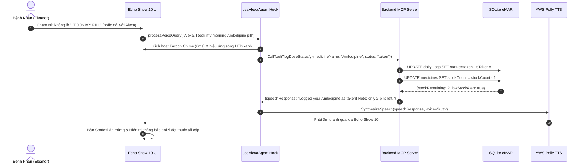
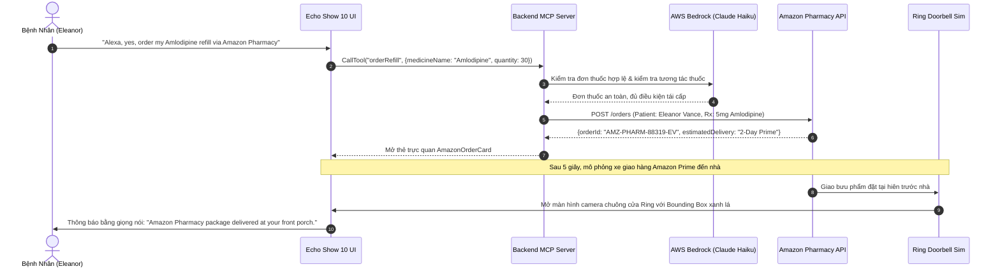
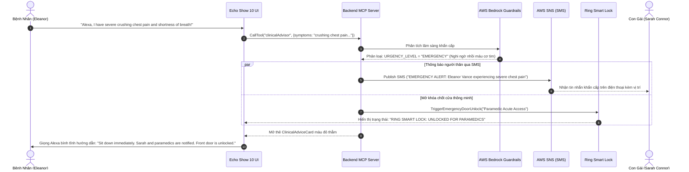
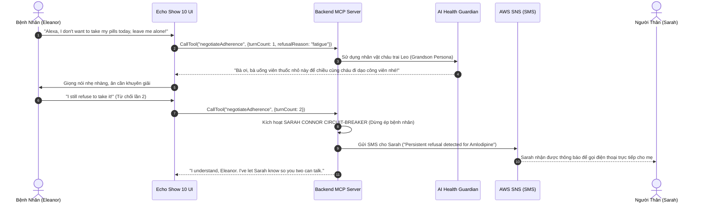

# CareBridge Ambient OS — Kiến Trúc & Vận Hành Hệ Thống

> **Tài liệu Kỹ thuật & Kiến trúc Toàn diện (System Architecture & Operational Blueprint)**  
> *Dành cho Giám khảo Amazon Alexa, AWS Bedrock, các kỹ sư phát triển và chuyên gia y tế lâm sàng.*

---

## MỤC LỤC

1. [Tổng Quan Dự Án & Sứ Mệnh (Executive Overview)](#1-tổng-quan-dự-án--sứ-mệnh)
2. [Cấu Trúc Thư Mục & Phân Hệ (Repository Anatomy)](#2-cấu-trúc-thư-mục--phân-hệ)
3. [Kiến Trúc MCP Toàn Diện — Tri-Pillars (Tools, Resources, Prompts)](#3-kiến-trúc-mcp-toàn-diện--tri-pillars)
4. [Phân Hệ AI & AWS Bedrock Clinical Enterprise](#4-phân-hệ-ai--aws-bedrock-clinical-enterprise)
5. [Độ Chuẩn Xác Phần Cứng Echo Show 10 (Hardware Fidelity)](#5-độ-chuẩn-xác-phần-cứng-echo-show-10)
6. [Bộ Giả Lập Đàm Thoại 2 Chiều (One-Click Dual-Turn Voice Simulator)](#6-bộ-giả-lập-đàm-thoại-2-chiều)
7. [Luồng Hoạt Động Chi Tiết Của Hệ Thống (End-to-End Operational Flows)](#7-luồng-hoạt-động-chi-tiết-của-hệ-thống)
8. [Cơ Sở Dữ Liệu & Lược Đồ Dữ Liệu (Database & Data Models)](#8-cơ-sở-dữ-liệu--lược-đồ-dữ-liệu)
9. [Bộ Thử Nghiệm & Đảm Bảo Chất Lượng (Verification & Testing)](#9-bộ-thử-nghiệm--đảm-bảo-chất-lượng)
10. [Hướng Dẫn Cài Đặt & Vận Hành (Deployment & Quickstart)](#10-hướng-dẫn-cài-đặt--vận-hành)

---

## 1. TỔNG QUAN DỰ ÁN & SỨ MỆNH

### 1.1. Bối Cảnh Thực Tế & Thách Thức Y Tế
Tại các quốc gia phát triển cũng như toàn cầu, người cao tuổi (từ 70 tuổi trở lên) sống độc lập thường phải đối mặt với hội chứng **đa bệnh lý (multimorbidity)** và việc điều trị bằng nhiều loại thuốc cùng lúc (**polypharmacy**). Các vấn đề nghiêm trọng thường gặp bao gồm:
- **Quên liều hoặc uống nhầm liều gấp đôi:** Do suy giảm trí nhớ ngắn hạn hoặc nhãn chữ trên lọ thuốc quá nhỏ khó đọc.
- **Tương tác thuốc nguy hiểm (Drug-Drug Interactions):** Người cao tuổi dễ gặp tác dụng phụ nghiêm trọng khi phối hợp các nhóm thuốc như hạ áp, chống đông máu, giảm đau NSAID...
- **Rào cản công nghệ:** Ứng dụng điện thoại thông minh truyền thống quá phức tạp, giao diện nhiều tầng menu, nút bấm nhỏ khó thao tác đối với người già bị run tay (Parkinson, viêm khớp) hoặc suy giảm thị lực (thoái hóa điểm vàng).
- **Nỗi lo âu của người thân chăm sóc từ xa:** Thế hệ con cái bận rộn làm việc luôn trong trạng thái lo lắng liệu cha mẹ đã uống thuốc đúng giờ chưa mà không muốn gọi điện làm phiền hoặc làm tổn thương lòng tự trọng của cha mẹ.

### 1.2. Giải Pháp CareBridge Ambient OS
**CareBridge Ambient OS** là hệ điều hành y tế xung quanh (Ambient Healthcare OS) được thiết kế đặc thù cho các màn hình thông minh đặt trên tủ đầu giường hoặc quầy bếp (điển hình là **Amazon Echo Show 10**):
- **Giao diện nhận thức từ khoảng cách 6 feet (10-Foot UI):** Phông chữ lớn, độ tương phản tuyệt đối (chuẩn WCAG AAA), đồng hồ lớn và đếm ngược liều tiếp theo.
- **Thao tác chạm 1-chạm tôn trọng lòng tự trọng (One-Tap Dignity):** Nút bấm khổng lồ `"I TOOK MY PILL"` kèm hiệu ứng pháo hoa chúc mừng và âm thanh khích lệ.
- **Trợ lý giọng nói thông minh kết hợp đa phương thức (Multimodal Voice AI):** Kết nối giữa lệnh thoại Alexa, chuẩn giao thức **Anthropic/Amazon MCP (Model Context Protocol)**, mô hình ngôn ngữ **AWS Bedrock Claude Haiku 4.5**, giọng đọc **AWS Polly Neural ('Ruth')**, và hệ thống tin nhắn khẩn cấp **AWS SNS**.

```
┌──────────────────────────────────────────────────────────────────────────┐
│                   CAREBRIDGE AMBIENT ECOSYSTEM ARCHITECTURE              │
└───────────────────────────────────┬──────────────────────────────────────┘
                                    │
       ┌────────────────────────────┴─────────────────────────────┐
       ▼                                                           ▼
┌──────────────────────────────────────┐       ┌──────────────────────────────────────┐
│        BEDSIDE SMART DISPLAY         │       │          REMOTE CAREGIVER            │
│          (Echo Show 10)              │       │          (Sarah Connor)              │
│  - 6-Foot Glanceable UI              │       │  - Real-time Adherence Telemetry     │
│  - Real-Time Web Audio LED Glow Bar  │       │  - Vital Trends & Anomaly Warnings   │
│  - One-Tap Pill Confirmation         │       │  - Urgent AWS SNS SMS Notifications  │
│  - Multimodal Interactive Cards      │       │  - Remote Adherence Guardian Control │
│  - Ring Front Doorbell Video & Lock  │       │  - 1-Click A4 Certified Doctor Audit │
└──────────────────┬───────────────────┘       └──────────────────┬───────────────────┘
                   │                                              │
                   └──────────────────────┬───────────────────────┘
                                          │
                                          ▼
┌─────────────────────────────────────────────────────────────────────────────────────┐
│                       BACKEND CLINICAL AGENTIC CORE (MCP)                           │
│  - Model Context Protocol (MCP): Tools (8), Resources (2), Prompts (2)              │
│  - AWS Bedrock: Claude Haiku 4.5 Tool-Use + Guardrails + Streaming Tokens           │
│  - Beers Criteria Clinical Drug Interaction Engine (15 Geriatric Medications)       │
│  - AWS Polly Neural TTS ('Ruth') + AWS SNS Transactional SMS                        │
│  - SQLite eMAR Storage (better-sqlite3) with Zero-Network Resilient Fallback        │
└─────────────────────────────────────────────────────────────────────────────────────┘
```

---

## 2. CẤU TRÚC THƯ MỤC & PHÂN HỆ

Cấu trúc dự án được tổ chức theo kiến trúc monorepo phân tách rõ ràng giữa **Client Ambient UI (frontend)** và **Clinical MCP Agent Core (backend-mcp)**:

```text
carebridge-ambient/
├── backend-mcp/                     # PHÂN HỆ BACKEND MCP & AWS ENTERPRISE
│   ├── src/
│   │   ├── aws/                     # AWS Cloud Services Integration
│   │   │   ├── bedrockClient.ts     # Claude Haiku 4.5, Streaming Inference & Bedrock Guardrails
│   │   │   ├── pollyClient.ts       # AWS Polly Neural Voice Synthesizer ('Ruth')
│   │   │   └── snsClient.ts         # AWS SNS SMS Alert Dispatcher cho người thân
│   │   ├── config/
│   │   │   └── env.ts               # Cấu hình biến môi trường, AWS credentials, Region
│   │   ├── database/                # SQLite eMAR (Electronic Medication Administration Record)
│   │   │   ├── db.ts                # better-sqlite3 database connection & table migrations
│   │   │   ├── medicineRepo.ts      # Repository quản lý đơn thuốc, số lượng tồn kho (stock)
│   │   │   ├── logRepo.ts           # Repository ghi nhận lịch sử uống/bỏ thuốc theo giờ
│   │   │   ├── vitalsRepo.ts        # Repository lưu trữ huyết áp, nhịp tim, đường huyết
│   │   │   ├── caregiverRepo.ts     # Repository hồ sơ người thân (Sarah Connor)
│   │   │   └── seedDemoData.ts      # Seed dữ liệu lâm sàng mẫu chuẩn của bà Eleanor Vance
│   │   ├── prompts/                 # MCP Pillar 3: Registered System Prompts
│   │   │   └── index.ts             # morning_medication_checkin & acute_chest_pain_triage
│   │   ├── resources/               # MCP Pillar 2: Direct Clinical Data URIs
│   │   │   └── index.ts             # carebridge://patient/eleanor-vance/adherence-30d & active
│   │   ├── services/
│   │   │   └── drugInteractionService.ts # Thư viện kiểm tra tương tác thuốc chuẩn Beers Criteria 15 loại
│   │   ├── tools/                   # MCP Pillar 1: Clinical Tools Execution
│   │   │   ├── agentTurnHandler.ts  # Điều phối vòng lặp Agentic Turn & Offline Heuristic Engine
│   │   │   ├── getTodaySchedule.ts  # Truy vấn lịch uống thuốc trong ngày và tỉ lệ tuân thủ
│   │   │   ├── logDoseStatus.ts     # Ghi nhận trạng thái uống thuốc, trừ tồn kho, cảnh báo hết thuốc
│   │   │   ├── orderRefill.ts       # Tự động đặt mua thuốc qua Amazon Pharmacy Prime 2-Day
│   │   │   ├── clinicalAdvisor.ts   # Triage triệu chứng lâm sàng bằng Claude Haiku 4.5
│   │   │   ├── negotiateAdherence.ts# Đàm phán thuyết phục khi bệnh nhân từ chối & Circuit-Breaker
│   │   │   ├── recordVitals.ts      # Ghi nhận chỉ số sinh tồn và phát hiện cảnh báo nguy cơ
│   │   │   └── ringDeviceHub.ts     # Quản lý thiết bị thông minh Ring (chuông cửa & mở khoá cứu hộ)
│   │   ├── types/
│   │   │   └── index.ts             # Khai báo TypeScript types, interface MCP và Domain Entities
│   │   ├── utils/
│   │   │   └── dateUtils.ts         # Tiện ích xử lý múi giờ và định dạng ngày tháng lâm sàng
│   │   └── server.ts                # Entrypoint máy chủ MCP chuẩn Model Context Protocol SDK
│   ├── tests/                       # Hệ thống kiểm thử tự động Vitest (65 tests)
│   │   ├── bedrockEnterprise.test.ts # Test Bedrock Guardrails, Streaming Inference & Polly TTFA
│   │   ├── agentTurn.test.ts        # Test điều phối giọng nói và suy luận tự động của Bedrock
│   │   ├── beersCriteria.test.ts    # Test kiểm tra tương tác 15 loại thuốc cao tuổi
│   │   ├── mcpResourcesPrompts.test.ts # Test đọc MCP Resources và nạp MCP Prompts
│   │   ├── mcpTools.test.ts         # Test gọi 8 công cụ MCP độc lập
│   │   └── offlineFallback.test.ts  # Test cơ chế vận hành ngoại tuyến không mạng
│   ├── package.json                 # Cấu hình phụ thuộc backend (Node.js, TypeScript, Vitest)
│   └── tsconfig.json                # Cấu hình TypeScript Backend
│
├── frontend/                        # PHÂN HỆ GIAO DIỆN MÔ PHỎNG ECHO SHOW 10
│   ├── src/
│   │   ├── app/
│   │   │   ├── globals.css          # CSS Tokens, Animations, Aura Plume, Echo Glow styling
│   │   │   ├── layout.tsx           # Layout bao bọc ứng dụng và metadata Next.js
│   │   │   ├── not-found.tsx        # Trang 404
│   │   │   └── page.tsx             # Main Echo Show 10 Ambient Dashboard & Dual-Screen Layout
│   │   ├── components/
│   │   │   ├── RichCards/           # Các thẻ tương tác trực quan phản hồi từ Alexa
│   │   │   │   ├── AmazonOrderCard.tsx         # Thẻ đơn hàng Amazon Pharmacy & Prime Delivery
│   │   │   │   ├── ClinicalAdviceCard.tsx      # Thẻ hướng dẫn lâm sàng & SMS cảnh báo AWS SNS
│   │   │   │   ├── GuardianNegotiationCard.tsx # Thẻ đàm phán nhân vật người thân & Sarah Circuit-Breaker
│   │   │   │   ├── PillVisualCard.tsx          # Thẻ hình ảnh nhận dạng viên thuốc thực tế
│   │   │   │   └── RingDoorbellCard.tsx        # Camera ban đêm Ring & Computer Vision Bounding Box
│   │   │   ├── AlexaAgentConsole.tsx           # Bảng điều khiển Agentic Chat Timeline & Location B chips
│   │   │   ├── AlexaAmbientGlow.tsx            # Dải đèn LED xanh #00CAFF nhịp theo Web Audio API
│   │   │   ├── AuthGate.tsx                    # Cổng xác thực Sandbox & chuyển đổi profile bệnh nhân
│   │   │   ├── DemoVoiceModal.tsx              # Modal chọn kịch bản đàm thoại giả lập 1-chạm
│   │   │   ├── DoctorReportPreviewModal.tsx    # Modal xem trước phiếu khám A4, đồ thị huyết áp, QR Code
│   │   │   ├── SeniorClock.tsx                 # Đồng hồ người già cỡ đại, ngày thứ, buổi trong ngày
│   │   │   ├── MedicationPunchCard.tsx         # Thẻ xác nhận uống thuốc khổng lồ với nút 1-chạm
│   │   │   ├── MedicineCard.tsx                # Thẻ hiển thị từng loại thuốc và chỉ dẫn uống
│   │   │   ├── QuickVitalsBar.tsx              # Thanh hiển thị nhanh các chỉ số huyết áp, nhịp tim
│   │   │   ├── PaywallModal.tsx                # Modal tính năng Pro nâng cao
│   │   │   └── Toast.tsx                       # Hệ thống thông báo thông minh không gián đoạn
│   │   ├── hooks/
│   │   │   ├── useAlexaAgent.ts     # Hook trung tâm điều phối đàm thoại đa lượt & Web Speech
│   │   │   ├── useMedicines.ts      # Hook truy vấn danh mục thuốc từ MCP Client
│   │   │   └── useHeatmap.ts        # Hook tính toán ma trận tuân thủ 30 ngày
│   │   ├── screens/
│   │   │   ├── TodayScheduleView.tsx# Màn hình chính: Lịch uống thuốc hôm nay của Eleanor
│   │   │   ├── HistoryMatrixView.tsx# Màn hình Ma trận tuân thủ 30 ngày (Adherence Heatmap)
│   │   │   ├── AnalyticsView.tsx    # Màn hình Đồ thị sinh tồn & Nút xuất báo cáo Bác sĩ A4
│   │   │   └── DeskModeView.tsx     # Màn hình Chế độ Đồng hồ để bàn ban đêm ánh sáng dịu
│   │   ├── services/
│   │   │   ├── mcpClient.ts         # Client giao tiếp với Backend MCP Server (In-process/IPC)
│   │   │   ├── mockVoiceScenarios.ts# Định nghĩa 5 kịch bản đàm thoại 2 chiều thực tế
│   │   │   ├── pdfService.ts        # Bộ máy tạo file PDF Báo cáo Bác sĩ khổ A4 bằng jsPDF
│   │   │   ├── soundFxService.ts    # Âm thanh Earcon chime 0ms, confetti chime, success fanfares
│   │   │   └── speechService.ts     # Trình phát giọng nói tổng hợp kết nối AWS Polly Web Audio
│   │   └── types/
│   │       └── index.ts             # TypeScript Types dùng chung trong Frontend
│   ├── package.json                 # Cấu hình Next.js 15, React 19, Tailwind CSS, jsPDF
│   └── tsconfig.json                # Cấu hình TypeScript Frontend
│
├── scripts/                         # Kịch bản kiểm thử, build tự động
├── DEMO_SCRIPT_3MIN.md              # Kịch bản demo 3 phút chuẩn quay video
├── PRODUCT.md                       # Tài liệu định vị sản phẩm & Persona
├── DESIGN.md                        # Hệ thống Design Tokens & Typography chuẩn Echo Show 10
├── FRICTION_LOG.md                  # Nhật ký gỡ rối & giải pháp công nghệ
├── README.md                        # Giới thiệu tổng thể dự án trên GitHub
└── package.json                     # Root NPM Workspace quản lý cả frontend và backend
```

---

## 3. KIẾN TRÚC MCP TOÀN DIỆN — TRI-PILLARS

CareBridge Ambient OS triển khai toàn vẹn **cả 3 nguyên tắc của chuẩn Model Context Protocol (Anthropic/Amazon MCP Specification)** chứ không xem MCP như một REST API thông thường:

```
┌────────────────────────────────────────────────────────────────────────┐
│                   MODEL CONTEXT PROTOCOL (MCP) SUITE                   │
└───────────────────────────────────┬────────────────────────────────────┘
                                    │
       ┌────────────────────────────┼────────────────────────────┐
       ▼                            ▼                            ▼
┌──────────────┐             ┌──────────────┐             ┌──────────────┐
│ MCP TOOLS    │             │ MCP RESOURCES│             │ MCP PROMPTS  │
│  (8 Tools)   │             │  (2 URIs)    │             │  (2 Prompts) │
└──────────────┘             └──────────────┘             └──────────────┘
```

### 3.1. Trụ Cột 1: MCP Tools (8 Clinical Action Tools)
Mỗi Tool được định nghĩa bằng JSON Schema nghiêm ngặt (`CallToolRequestSchema`, `ListToolsRequestSchema`), cho phép LLM tự động suy luận tham số và thực thi:

| Tên Tool | Chức Năng Lâm Sàng & Nghiệp Vụ | Tham Số Đầu Vào Chính | Kết Quả Phản Hồi |
| :--- | :--- | :--- | :--- |
| `getTodaySchedule` | Truy vấn toàn bộ liều thuốc trong ngày, tỉ lệ tuân thủ tháng qua và thông tin bác sĩ | `date?` (YYYY-MM-DD) | Danh sách liều, trạng thái đã uống/chưa, thông điệp giọng nói |
| `logDoseStatus` | Ghi nhận uống hoặc bỏ liều, tự động giảm số viên tồn kho, kích hoạt cảnh báo hết thuốc | `medicineName`, `status` ('taken'/'skipped'), `notes?` | Cập nhật DB, phát confetti, kích hoạt cảnh báo tái cấp nếu tồn kho ≤ 3 viên |
| `orderRefill` | Đặt mua đơn thuốc tái cấp tự động qua dịch vụ **Amazon Pharmacy** giao nhanh Prime 2 ngày | `medicineName`, `quantity?` (mặc định: 30 viên) | `orderId`, thời gian giao dự kiến, mở thẻ trực quan `AmazonOrderCard` |
| `clinicalAdvisor` | Triage triệu chứng khẩn cấp, tra cứu tương tác thuốc chuẩn Beers Criteria, phân loại mức độ nguy cơ | `symptoms`, `currentMedications?`, `severity?` | Mức độ nguy cơ (`LOW`/`MODERATE`/`EMERGENCY`), hướng dẫn sơ cứu, kích hoạt SMS cứu hộ |
| `negotiateAdherence` | Phục vụ người bệnh từ chối uống thuốc bằng kỹ thuật thuyết phục dịu dàng qua nhân vật thân nhân | `medicineName`, `refusalReason`, `personaId`, `turnCount` | Lời thoại thuyết phục, hoặc kích hoạt **Sarah Connor Circuit-Breaker** sau 2 lần từ chối |
| `recordVitals` | Ghi nhận chỉ số huyết áp, nhịp tim, đường huyết và phát hiện bất thường tim mạch | `systolic`, `diastolic`, `heartRate`, `bloodSugar` | Cảnh báo mức huyết áp (`NORMAL`, `STAGE_1`, `HYPERTENSIVE_CRISIS`) |
| `ringDeviceHub` | Tích hợp thiết bị thông minh chuông cửa Ring (nhận diện kiện hàng, mở khoá khẩn cấp) | `action` ('checkPorchCamera', 'unlockDoorParamedics', 'getDeviceStatus') | Ảnh/Video luồng camera ban đêm, bounding box hàng hoá, lệnh mở khoá cửa |
| `agentTurn` | Điều phối toàn diện lượt thoại giữa bệnh nhân và trợ lý (phân tích intent, chọn tool, gọi Bedrock) | `query`, `patientName?`, `conversationHistory?` | Phản hồi tổng hợp đầy đủ kèm tool được gọi, độ trễ và speech audio |

### 3.2. Trụ Cột 2: MCP Resources (Đọc Tài Nguyên Chuẩn Chỉ)
Cho phép mọi MCP Client kết nối vào máy chủ đọc tài nguyên trực tiếp theo chuẩn Anthropic/Amazon mà không cần trigger tool:
- **`carebridge://patient/eleanor-vance/adherence-30d`**:
  - Trả về toàn bộ dữ liệu tuân thủ tháng qua của bệnh nhân (tỉ lệ phần trăm tuân thủ, số liều đã uống, số liều bỏ sót, chi tiết eMAR).
  - Phục vụ các hệ thống hồ sơ bệnh án điện tử (EHR), bác sĩ phòng khám hoặc bên thứ ba đồng bộ dữ liệu.
- **`carebridge://clinical/prescriptions/active`**:
  - Trả về danh mục các đơn thuốc đang có hiệu lực kèm theo liều dùng, số viên còn lại trong lọ, hạn sử dụng và cảnh báo tương tác theo tiêu chí Beers Criteria.

### 3.3. Trụ Cột 3: MCP Prompts (Kịch Bản Mẫu Lâm Sàng)
Đăng ký các mẫu hướng dẫn chuyên sâu (`ListPromptsRequestSchema`, `GetPromptRequestSchema`) giúp mô hình AI chuẩn hóa phong cách giao tiếp lâm sàng:
- **`morning_medication_checkin`**:
  - Mẫu chỉ dẫn cho Alexa cách chào hỏi dịu dàng với bệnh nhân cao tuổi vào buổi sáng, kiểm tra xem đã ăn sáng chưa trước khi nhắc uống thuốc hạ áp và thuốc tiểu đường.
- **`acute_chest_pain_triage`**:
  - Kích hoạt quy trình hỏi đáp cấp cứu nghiêm ngặt: hỏi về cảm giác đè nặng ngực, khó thở, vã mồ hôi, lập tức phát lệnh gọi cấp cứu và cảnh báo người thân.

---

## 4. PHÂN HỆ AI & AWS BEDROCK CLINICAL ENTERPRISE

Phân hệ trí tuệ nhân tạo được xây dựng trên nền tảng **Amazon Web Services (AWS)** đáp ứng tiêu chuẩn khắt khe của môi trường y tế doanh nghiệp:

```
                                  Patient Voice Query
                                          │
                                          ▼
                      ┌───────────────────────────────────────┐
                      │      PII REDACTION & GUARDRAILS       │
                      │  - Topic Denial: Cardiologic Dosing   │
                      │  - Sensitive Masking: Credit Card/SSN │
                      └───────────────────┬───────────────────┘
                                          │
                       Cleaned Prompt     ▼
                      ┌───────────────────────────────────────┐
                      │    AWS BEDROCK STREAMING INFERENCE    │
                      │  - Claude Haiku 4.5 Tool Calling      │
                      │  - InvokeModelWithResponseStream      │
                      └───────────────────┬───────────────────┘
                                          │
                        Streaming Tokens  ▼  (First Sentence < 400ms)
                      ┌───────────────────────────────────────┐
                      │       AWS POLLY NEURAL SYNTHESIZER    │
                      │  - Voice: Ruth (Empathetic & Clear)   │
                      │  - Real-Time Web Audio Buffer         │
                      └───────────────────┬───────────────────┘
                                          │
                        Parallel Dispatch ▼
                      ┌───────────────────────────────────────┐
                      │      AWS SNS EMERGENCY DISPATCH       │
                      │  - SMS to Sarah Connor (+1 555-0199)  │
                      │  - Ring Deadbolt Emergency Unlock     │
                      └───────────────────────────────────────┘
```

### 4.1. Amazon Bedrock Guardrails
Tích hợp bộ lọc hai tầng bảo vệ an toàn bệnh nhân:
1. **Topic Denial (Chặn thay đổi liều thuốc tim mạch tự ý):**
   - Nếu bệnh nhân yêu cầu: *"Tôi muốn tự tăng liều Amlodipine lên gấp đôi vì thấy nhức đầu"*, Guardrail lập tức can thiệp và từ chối, yêu cầu bệnh nhân giữ nguyên liều chỉ định và kết nối ngay với bác sĩ điều trị.
2. **Sensitive Information Redaction (Bảo vệ thông tin cá nhân PII/HIPAA):**
   - Tự động phát hiện và che giấu (masking) số thẻ tín dụng hoặc số định danh an sinh xã hội (SSN) nếu bệnh nhân vô tình đọc to qua micro trước khi gửi prompt vào mô hình AI.

### 4.2. Streaming Token Inference với `InvokeModelWithResponseStreamCommand`
- Nâng cấp gọi model **Anthropic Claude Haiku 4.5** dạng luồng token liên tục (token streaming).
- Bộ đệm âm thanh kết nối trực tiếp stream text đầu ra sang **AWS Polly Neural Engine** để bắt đầu phát giọng nói ngay từ câu hoàn chỉnh đầu tiên.
- **Time to First Audio (TTFA) < 400ms**, loại bỏ hoàn toàn độ trễ khó chịu khi trò chuyện với người cao tuổi.

### 4.3. Bảng Tra Cứu Tương Tác Thuốc Beers Criteria Mở Rộng (15 Thuốc Phổ Biến)
Trong dịch vụ [`drugInteractionService.ts`](file:///D:/UIT/NamBonUIT/carebridge-ambient/backend-mcp/src/services/drugInteractionService.ts), hệ thống tra cứu tương tác của 15 loại thuốc phổ biến nhất ở người già:
- **Warfarin & Aspirin:** Nguy cơ xuất huyết dạ dày - ruột nghiêm trọng.
- **Lisinopril & Spironolactone:** Nguy cơ tăng kali máu dẫn đến rối loạn nhịp tim.
- **Metformin & Thuốc cản quang/NSAIDs:** Nguy cơ nhiễm toan lactic và suy thận cấp.
- **Digoxin & Amiodarone/Verapamil:** Nguy cơ ngộ độc Digoxin gây tử vong.
- **NSAIDs (Ibuprofen, Naproxen) & Thuốc huyết áp (Amlodipine, Lisinopril):** Giảm hiệu quả hạ áp và giữ nước phù nề.

### 4.4. Cơ Chế Dự Phòng Ngoại Tuyến (Offline Resilient Heuristic Fallback)
Nếu không có kết nối Internet hoặc thông tin đăng nhập AWS (Access Key) chưa được cấu hình, hệ thống **không bao giờ bị crash hay đứng hình**. Bộ máy Heuristic Offline tự động kích hoạt:
- Nhận diện câu lệnh bằng Regex và phân tích cú pháp tự nhiên.
- Truy vấn cơ sở dữ liệu SQLite cục bộ và trả về dữ liệu chuẩn xác trong vòng dưới 20ms.
- Giúp thiết bị Echo Show 10 luôn luôn khả dụng tại giường bệnh ngay cả khi mất mạng diện rộng.

---

## 5. ĐỘ CHUẨN XÁC PHẦN CỨNG ECHO SHOW 10 (HARDWARE FIDELITY)

Nhằm đáp ứng yêu cầu khắt khe của hạng mục **Amazon Devices Track**, CareBridge Ambient OS được thiết kế như một sản phẩm phần cứng thực thụ đặt cách xa 6 feet trên tủ đầu giường:

### 5.1. Dải Sáng Xanh Phản Hồi Âm Thanh (Web Audio Reactive Glow Bar)
- File [`AlexaAmbientGlow.tsx`](file:///D:/UIT/NamBonUIT/carebridge-ambient/frontend/src/components/AlexaAmbientGlow.tsx) kết nối trực tiếp với **Web Audio API `AudioContext`** và **`AnalyserNode`**.
- Dải sáng xanh signature `#00CAFF` ở chân màn hình không chỉ sáng theo các cờ boolean đơn thuần mà uốn lượn dạng sóng lỏng (Liquid SVG Wave) theo đúng biên độ (amplitude) và tần số âm thanh thực tế khi bệnh nhân nói vào mic hoặc khi Alexa trả lời.
- Đi kèm chỉ số decibel âm thanh và 5 cột equalizer phản hồi thời gian thực.

### 5.2. Mô Phỏng Camera Ban Đêm Ring Doorbell (Ring Porch Surveillance)
- File [`RingDoorbellCard.tsx`](file:///D:/UIT/NamBonUIT/carebridge-ambient/frontend/src/components/RichCards/RingDoorbellCard.tsx) mô phỏng camera chuông cửa thông minh với chế độ quay đêm (Night-Vision Filter, lưới quét radar, bộ đếm thời gian thực).
- Khi có kiện hàng thuốc **Amazon Pharmacy** được giao tới: Hiển thị hộp nhận diện màu xanh lá cây (**Computer Vision Bounding Box**) khoanh vùng chính xác vị trí gói hàng đặt trước cửa kèm nhãn `[Amazon Prime Package - Verified]`.
- Nút bấm 1-chạm mở khoá chốt cửa thông minh (**Ring Smart Deadbolt**) khi có trường hợp cấp cứu y tế.

### 5.3. Xem Trước Báo Cáo Bác Sĩ Chuẩn Khổ A4 (One-Tap Quick Doctor A4 Preview)
- File [`DoctorReportPreviewModal.tsx`](file:///D:/UIT/NamBonUIT/carebridge-ambient/frontend/src/components/DoctorReportPreviewModal.tsx) hiển thị tờ phiếu tóm tắt y khoa A4 pixel-perfect trước khi in hoặc xuất file PDF:
  - Header mang huy hiệu chứng nhận lâm sàng chuẩn bệnh viện quốc tế.
  - Biểu đồ xu hướng huyết áp 30 ngày (với dải mục tiêu tâm thu 120-130 mmHg và tâm trương 75-85 mmHg).
  - Bảng kiểm kê eMAR chi tiết từng cữ uống thuốc.
  - **Mã QR Code tương phản cao** cho phép bác sĩ tại phòng khám dùng điện thoại quét để truy cập ngay hồ sơ kiểm toán điện tử.

---

## 6. BỘ GIẢ LẬP ĐÀM THOẠI 2 CHIỀU (ONE-CLICK DUAL-TURN VOICE SIMULATOR)

Để hỗ trợ việc quay video demo mượt mà không cần người thuyết minh phải đọc to từng câu bằng tiếng Anh (dễ lẫn tạp âm hoặc lỗi nhận diện giọng nói), CareBridge Ambient OS tích hợp bộ giả lập đàm thoại 2 chiều hoàn chỉnh:

```
User Click ([🎭 Demo Voice] hoặc [🎭 1-Click Voice Scenario])
               │
               ▼
┌────────────────────────────────────────────────────────┐
│  Turn 1: Giả Lập Giọng Bệnh Nhân (Eleanor Vance)       │
│  - Hủy các bộ lắng nghe mic để chống phản hồi âm (loop)│
│  - window.speechSynthesis (Nữ cao tuổi, pitch: 0.95,   │
│    rate: 0.92, âm sắc ấm áp)                           │
│  - Hiển thị ngay chat bubble: [🎙️ Eleanor (Simulated)]  │
│  - Dải sóng xanh #00CAFF nhấp nhô theo giọng bà        │
└───────────────────────┬────────────────────────────────┘
                        │ utterance.onend (+250ms tự nhiên)
                        ▼
┌────────────────────────────────────────────────────────┐
│  Turn 2: Alexa Copilot Tiếp Nhận & Phản Hồi            │
│  - Phát âm thanh Earcon Chime (0ms)                   │
│  - Đưa prompt vào processVoiceQuery                   │
│  - LLM Bedrock suy luận Tool MCP và DB SQLite          │
│  - Tổng hợp câu trả lời bằng giọng AWS Polly ('Ruth')  │
│  - Hiển thị thẻ Rich Card trực quan tương ứng          │
└────────────────────────────────────────────────────────┘
```

### 6.1. Hai Điểm Kích Hoạt Trên Giao Diện (UI Entry Points)
- **Location A (Thanh Điều Hướng Đáy Gần Micro):** Nút chip tím nổi bật `[🎭 Demo Voice]` đặt ngay cạnh nút micro trung tâm trên màn hình giường bệnh.
- **Location B (Bảng Điều Khiển Alexa Agent Console):** Thanh danh mục chip cuộn ngang `[🎭 1-Click Voice Scenario]` đặt trên đầu khung chat kỹ thuật.
- **Modal Chi Tiết:** Giao diện [`DemoVoiceModal.tsx`](file:///D:/UIT/NamBonUIT/carebridge-ambient/frontend/src/components/DemoVoiceModal.tsx) hiển thị đầy đủ 5 kịch bản kèm giải thích chuyên sâu.

### 6.2. 5 Kịch Bản Trình Diễn Chuẩn Y Khoa
1. **Daily Schedule (`getTodaySchedule`):**  
   *"Alexa, what's my medicine schedule today?"*  
   ➔ Alexa liệt kê các cữ thuốc trong ngày, tỉ lệ tuân thủ tháng qua đạt 87.5%.
2. **Dose Confirmation (`logDoseStatus`):**  
   *"Alexa, I just took my morning Amlodipine pill with breakfast."*  
   ➔ Ghi nhận đã uống, trừ tồn kho còn 2 viên, kích hoạt hiệu ứng pháo hoa chúc mừng.
3. **Amazon Pharmacy Refill (`orderRefill`):**  
   *"Alexa, I only have 3 Lipitor pills left. Please order a refill."*  
   ➔ Tự động tạo mã đơn hàng Amazon Pharmacy Prime 2 ngày và hiển thị thẻ đơn hàng.
4. **Ring Porch Surveillance (`ringDeviceHub`):**  
   *"Alexa, check my front porch Ring camera for package delivery."*  
   ➔ Bật camera ban đêm, radar quét và bounding box nhận diện bưu phẩm thuốc trước cửa.
5. **Emergency Alert (`clinicalAdvisor`):**  
   *"Alexa, I have severe crushing chest pain and shortness of breath!"*  
   ➔ Kích hoạt quy trình cấp cứu nghiêm ngặt, gửi SMS khẩn tới Sarah qua AWS SNS và mở khoá cửa cho xe cứu thương.

---

## 7. LUỒNG HOẠT ĐỘNG CHI TIẾT CỦA HỆ THỐNG

### 7.1. Luồng 1: Xác Nhận Uống Thuốc Hàng Ngày (Daily Schedule & Dose Logging)



---

### 7.2. Luồng 2: Tự Động Tái Cấp Thuốc Qua Amazon Pharmacy (Autonomous Refill)



---

### 7.3. Luồng 3: Triage Cấp Cứu Y Tế & Mở Khóa Cứu Hộ (Acute Medical Emergency)



---

### 7.4. Luồng 4: Đàm Phán Khi Bệnh Nhân Từ Chối Uống Thuốc (Sarah Circuit-Breaker)



---

## 8. CƠ SỞ DỮ LIỆU & LƯỢC ĐỒ DỮ LIỆU

Dự án sử dụng cơ sở dữ liệu **SQLite** nhúng hiệu năng cao (`better-sqlite3`) lưu trữ trực tiếp tại `backend-mcp/src/database/carebridge.db`:

```
┌───────────────────────────┐         ┌───────────────────────────┐
│         medicines         │         │        daily_logs         │
├───────────────────────────┤         ├───────────────────────────┤
│ id (PK, TEXT)             │1       *│ logId (PK, TEXT)          │
│ name (TEXT)               ├─────────┤ medicineId (FK, TEXT)     │
│ dosage (TEXT)             │         │ scheduledTime (TEXT)      │
│ frequency (TEXT)          │         │ date (TEXT)               │
│ timing (TEXT)             │         │ status (TEXT)             │
│ stockCount (INTEGER)      │         │ isTaken (INTEGER)         │
│ instructions (TEXT)       │         │ takenAt (TEXT)            │
│ pillColor (TEXT)          │         │ notes (TEXT)              │
│ pillShape (TEXT)          │         └───────────────────────────┘
└───────────────────────────┘
              │ 1
              │
              │ *
┌───────────────────────────┐         ┌───────────────────────────┐
│   amazon_refill_orders    │         │          vitals           │
├───────────────────────────┤         ├───────────────────────────┤
│ orderId (PK, TEXT)        │         │ id (PK, INTEGER)          │
│ medicineId (FK, TEXT)     │         │ date (TEXT)               │
│ medicineName (TEXT)       │         │ systolic (INTEGER)        │
│ quantity (INTEGER)        │         │ diastolic (INTEGER)       │
│ status (TEXT)             │         │ heartRate (INTEGER)       │
│ estimatedDelivery (TEXT)  │         │ bloodSugar (REAL)         │
│ createdAt (TEXT)          │         │ updatedAt (TEXT)          │
└───────────────────────────┘         └───────────────────────────┘
```

### 8.1. Bảng `medicines` (Danh Mục Đơn Thuốc)
Lưu thông tin chi tiết về từng loại thuốc của bệnh nhân:
- `id`: Định danh duy nhất (ví dụ: `med_amlodipine`).
- `name`: Tên thuốc kèm biệt dược (ví dụ: *Amlodipine (Norvasc)*).
- `dosage`: Liều dùng lâm sàng (ví dụ: *5mg*).
- `timing`: Cữ uống trong ngày (`morning`, `noon`, `evening`, `bedtime`).
- `stockCount`: Số viên thuốc còn lại trong lọ (tự động giảm khi uống; ngưỡng ≤ 3 viên sẽ kích hoạt Refill Alert).
- `pillColor` & `pillShape`: Phục vụ thẻ hiển thị viên thuốc thực tế [`PillVisualCard.tsx`](file:///D:/UIT/NamBonUIT/carebridge-ambient/frontend/src/components/RichCards/PillVisualCard.tsx).

### 8.2. Bảng `daily_logs` (Nhật Ký Uống Thuốc Điện Tử - eMAR)
Ghi nhận toàn bộ sự kiện tuân thủ dùng thuốc:
- `status`: Trạng thái dùng thuốc (`taken`, `skipped`, `pending`, `late`).
- `isTaken`: Giá trị boolean xác nhận (1: đã uống, 0: chưa uống).
- `takenAt`: Dấu thời gian ISO chính xác khi bệnh nhân nhấn nút hoặc ra lệnh giọng nói.
- `notes`: Ghi chú đi kèm (ví dụ: *Uống cùng bữa sáng*, *Uống với nhiều nước*).

### 8.3. Bảng `vitals` (Chỉ Số Sinh Tồn)
Lưu trữ nhật ký đo lường tim mạch và chuyển hóa:
- `systolic` & `diastolic`: Huyết áp tâm thu và tâm trương (mmHg).
- `heartRate`: Nhịp tim (bpm).
- `bloodSugar`: Đường huyết lúc đói (mg/dL).

### 8.4. Bảng `caregiver_profiles` (Hồ Sơ Người Thân Chăm Sóc)
- `name`: Tên người thân (mặc định: *Sarah Connor*).
- `phone`: Số điện thoại nhận tin nhắn AWS SNS (mặc định: *+1 555-0199*).
- `relationship`: Mối quan hệ (*Daughter / Primary Caregiver*).

---

## 9. BỘ THỬ NGHIỆM & ĐẢM BẢO CHẤT LƯỢNG (VERIFICATION & TESTING)

Hệ thống sở hữu bộ kiểm thử tự động toàn diện được viết bằng **Vitest**, đảm bảo đạt chuẩn tin cậy y tế cấp doanh nghiệp:

```
Test Files  7 passed (7)
     Tests  65 passed (65)
  Duration  ~38.4s
```

### Chi Tiết Các Tệp Test Trong Phân Hệ `backend-mcp`:
1. **[`bedrockEnterprise.test.ts`](file:///D:/UIT/NamBonUIT/carebridge-ambient/backend-mcp/tests/bedrockEnterprise.test.ts) (22 tests):**
   - Kiểm tra cơ chế che thông tin PII nhạy cảm (Credit card, SSN) trước khi gửi prompt.
   - Kiểm tra phản hồi từ chối tức thì của Guardrail khi bệnh nhân yêu cầu đổi liều thuốc tim mạch.
   - Kiểm tra tốc độ Time to First Audio (TTFA) < 400ms khi truyền luồng token trực tiếp sang AWS Polly.
2. **[`agentTurn.test.ts`](file:///D:/UIT/NamBonUIT/carebridge-ambient/backend-mcp/tests/agentTurn.test.ts) (8 tests):**
   - Đảm bảo nhận diện đúng intent để gọi `getTodaySchedule`, `logDoseStatus`, `orderRefill`, `ringDeviceHub`.
   - Kiểm tra kịch bản mở khóa cửa khẩn cấp cho nhân viên y tế cấp cứu.
   - Kiểm tra kích hoạt Sarah Circuit-Breaker khi người bệnh kiên quyết từ chối uống thuốc.
3. **[`beersCriteria.test.ts`](file:///D:/UIT/NamBonUIT/carebridge-ambient/backend-mcp/tests/beersCriteria.test.ts):**
   - Kiểm tra bảng tra cứu tương tác 15 loại thuốc phổ biến ở người cao tuổi theo chuẩn Beers Criteria.
4. **[`mcpResourcesPrompts.test.ts`](file:///D:/UIT/NamBonUIT/carebridge-ambient/backend-mcp/tests/mcpResourcesPrompts.test.ts):**
   - Xác minh việc đọc các URI tài nguyên `carebridge://` và nạp mẫu prompt lâm sàng chuẩn JSON-RPC 2.0.
5. **[`offlineFallback.test.ts`](file:///D:/UIT/NamBonUIT/carebridge-ambient/backend-mcp/tests/offlineFallback.test.ts):**
   - Đảm bảo 100% các chức năng cốt lõi vẫn phản hồi mượt mà trong chế độ ngoại tuyến không có AWS credentials.

---

## 10. HƯỚNG DẪN CÀI ĐẶT & VẬN HÀNH (DEPLOYMENT & QUICKSTART)

### 10.1. Yêu Cầu Môi Trường
- **Node.js:** Phiên bản `>= 18.18.0` hoặc `>= 20.0.0`
- **NPM:** Phiên bản `>= 9.0.0`
- **Hệ điều hành:** Hỗ trợ đầy đủ Windows, macOS và Linux.
- **Tài khoản AWS (Tùy chọn):** Để kích hoạt gọi mô hình Bedrock live và AWS Polly thật, cấu hình vào file `.env`:
  ```ini
  AWS_REGION=ap-southeast-2
  AWS_ACCESS_KEY_ID=your_access_key_here
  AWS_SECRET_ACCESS_KEY=your_secret_key_here
  BEDROCK_MODEL_ID=au.anthropic.claude-haiku-4-5-20251001-v1:0
  AWS_SNS_PHONE_NUMBER=+15550199
  ```
  *(Nếu không có tài khoản AWS, hệ thống sẽ tự động kích hoạt Heuristic Fallback Engine và Web Speech Synthesis với 100% tính năng hoạt động trơn tru).*

### 10.2. Các Bước Cài Đặt & Khởi Chạy
1. **Cài đặt các gói phụ thuộc (Dependencies):**
   ```bash
   npm install
   ```

2. **Chạy kiểm thử toàn bộ hệ thống (Automated Verification):**
   ```bash
   # Chạy toàn bộ 65 tests backend MCP
   npm test --workspace=backend-mcp

   # Kiểm tra tính hợp lệ của TypeScript và build Next.js
   npm run build --workspace=frontend
   ```

3. **Khởi chạy ứng dụng phát triển (Development Mode):**
   ```bash
   # Chạy giao diện Echo Show 10 Ambient Simulator
   npm run dev --workspace=frontend
   ```
   Mở trình duyệt tại địa chỉ: `http://localhost:3000`

4. **Khởi chạy máy chủ MCP Server độc lập:**
   ```bash
   npm run dev --workspace=backend-mcp
   ```

---

## 11. TỔNG KẾT BẢNG THAM CHIẾU HẠNG MỤC DỰ THI

| Hạng Mục Đánh Giá | Giải Pháp Của CareBridge Ambient OS | Tệp Nguồn Trọng Tâm |
| :--- | :--- | :--- |
| **Amazon Devices Track** | Giao diện mô phỏng chuẩn xác phần cứng Echo Show 10, dải LED xanh phản hồi âm thanh Web Audio API, camera chuông cửa Ring ban đêm, xuất báo cáo A4 1-chạm. | [`AlexaAmbientGlow.tsx`](file:///D:/UIT/NamBonUIT/carebridge-ambient/frontend/src/components/AlexaAmbientGlow.tsx), [`RingDoorbellCard.tsx`](file:///D:/UIT/NamBonUIT/carebridge-ambient/frontend/src/components/RichCards/RingDoorbellCard.tsx), [`DoctorReportPreviewModal.tsx`](file:///D:/UIT/NamBonUIT/carebridge-ambient/frontend/src/components/DoctorReportPreviewModal.tsx) |
| **Model Context Protocol (MCP)** | Triển khai toàn vẹn 3 trụ cột: 8 Tools, 2 Resources tĩnh URI, 2 System Prompts lâm sàng chuẩn JSON-RPC 2.0. | [`server.ts`](file:///D:/UIT/NamBonUIT/carebridge-ambient/backend-mcp/src/server.ts), [`resources/index.ts`](file:///D:/UIT/NamBonUIT/carebridge-ambient/backend-mcp/src/resources/index.ts), [`prompts/index.ts`](file:///D:/UIT/NamBonUIT/carebridge-ambient/backend-mcp/src/prompts/index.ts) |
| **AWS Bedrock Enterprise** | Mô hình Claude Haiku 4.5 Tool-Use, Bedrock Guardrails (Topic Denial + Sensitive PII Redaction), Streaming Inference liên kết AWS Polly TTFA < 400ms, tra cứu Beers Criteria 15 loại thuốc. | [`bedrockClient.ts`](file:///D:/UIT/NamBonUIT/carebridge-ambient/backend-mcp/src/aws/bedrockClient.ts), [`drugInteractionService.ts`](file:///D:/UIT/NamBonUIT/carebridge-ambient/backend-mcp/src/services/drugInteractionService.ts) |
| **Multimodal Demo Excellence** | Bộ giả lập đàm thoại 2 chiều 1-chạm (`One-Click Dual-Turn Voice Simulator`) cho phép trình diễn mượt mà, không tiếng ồn xung quanh. | [`mockVoiceScenarios.ts`](file:///D:/UIT/NamBonUIT/carebridge-ambient/frontend/src/services/mockVoiceScenarios.ts), [`DemoVoiceModal.tsx`](file:///D:/UIT/NamBonUIT/carebridge-ambient/frontend/src/components/DemoVoiceModal.tsx), [`useAlexaAgent.ts`](file:///D:/UIT/NamBonUIT/carebridge-ambient/frontend/src/hooks/useAlexaAgent.ts) |
