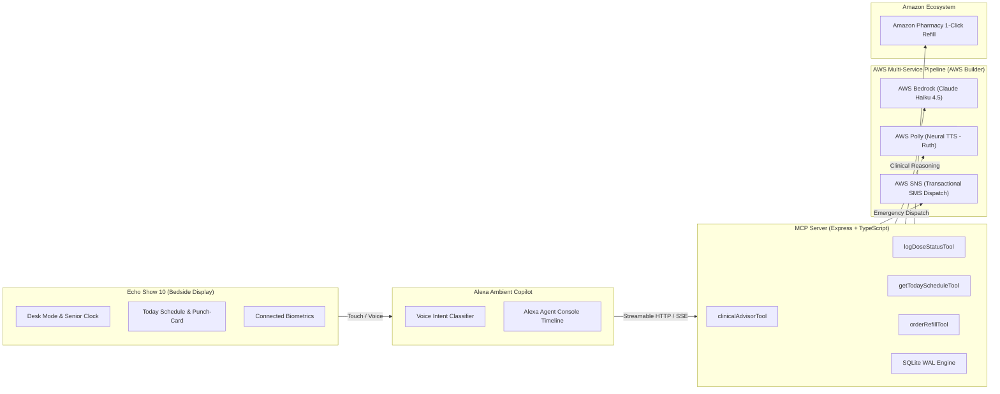

# CareBridge Ambient OS

> **Ambient Medication Adherence & Clinical AI Companion for Smart Displays**  
> *Engineered for independent seniors (Echo Show 10) and remote family caregivers, powered by AWS Bedrock Anthropic Claude Haiku 4.5 and Model Context Protocol (MCP).*

---

## 🌟 Overview

**CareBridge Ambient OS** is a 24/7 proactive healthcare operating system designed for bedside nightstand displays, kitchen counter smart hubs (such as the Amazon Echo Show 10), and caregiver dashboards.

It bridges the care gap between aging seniors living independently and their remote adult children:
- **Glanceable at 6 Feet:** High-contrast digital clock, upcoming dose indicators, and progress rings visible across a dimly lit bedroom.
- **Multimodal Alexa Voice Assistant:** Voice-first intent recognition powered by AWS Bedrock Anthropic Claude Haiku 4.5 (`au.anthropic.claude-haiku-4-5-20251001-v1:0` in Sydney `ap-southeast-2`).
- **Tremor-Tolerant Dignity:** 56px+ oversized touch hitboxes (`"I TOOK MY PILL"`) with celebratory particle feedback (`canvas-confetti`) and auditory positive reinforcement.
- **Auditable Family Telemetry:** Instant synchronization via Model Context Protocol (MCP) and SQLite in Write-Ahead Logging (WAL) mode for immutable audit trails.

---

## 🏗️ Architecture



---

## 🚀 Key Capabilities

1. **Ambient Bedside Clock & Desk Mode (`DeskModeView`)**
   - Extra-large digital clock with subtle pulsing cyan colon and dimmed seconds display to prevent nighttime anxiety.
   - Single-focus upcoming medication card with one-touch audio pronunciation via Alexa TTS.
   - Massive hero button: **"I TOOK MY PILL"** with haptic feedback and immediate optimistic UI updates.

2. **Copilot Chat & Tool Stream (`AlexaAgentConsole`)**
   - Full-height agentic timeline inspired by Claude and ChatGPT.
   - Compact quick-test prompt chips:
     - 💬 `"What's my schedule?"`
     - 💊 `"Took Amlodipine"`
     - ⚠️ `"Mild dizziness"`
     - 🚨 `"Severe chest pain"`
   - Inline tool call accordions showing execution latency and collapsible raw JSON inspection.

3. **Clinical AI Symptom & Interaction Triage**
   - Dispatches natural-language patient queries directly to AWS Bedrock Anthropic Claude Haiku 4.5.
   - Categorizes risk into clinical triage levels (`LOW`, `MEDIUM`, `HIGH`, `EMERGENCY`).
   - Plain-English action advice, clinical rationale, and automated caregiver alert triggers.

4. **Emergency Triage SMS Dispatch via AWS SNS (`clinicalAdvisor` Tool)**
   - When Bedrock evaluates symptoms as `HIGH` or `EMERGENCY` (e.g., crushing chest pain or severe shortness of breath), CareBridge automatically triggers **AWS Simple Notification Service (SNS)**.
   - Dispatches an instantaneous high-priority `Transactional` SMS alert to the designated family caregiver (Sarah Connor, `+1 555-0199`) containing patient vitals, symptom description, and ambient status.
   - Visual `ClinicalAdviceCard` presents a live telemetry banner with message ID, carrier status, and delivery timestamps.

5. **Amazon Pharmacy 1-Click Refill (`orderRefill` Tool)**
   - Proactive low-stock threshold detection ($\le 5$ pills remaining) triggered directly after dose confirmation.
   - Autonomous multi-turn voice order placement generating official Amazon Order IDs (`114-XXXXXXX-XXXXXXX`).
   - High-contrast `AmazonOrderCard` featuring Prime 2-Day free delivery estimations and instant SQLite stock replenishment (+30 tablets).

6. **Caregiver Matrix & Adherence Telemetry (`HistoryMatrixView`)**
   - 30-day compliance punch-card matrix tracking adherence streaks.
   - Single-click export for physician consultations generated via `jsPDF`.

7. **Signature Alexa Cyan Ambient Glow (`AlexaAmbientGlow.tsx`)**
   - Recreates the iconic physical light bar of real Amazon Echo Show smart displays.
   - Whenever Alexa is listening, reasoning with Bedrock, or synthesizing speech with Polly, the bottom edge of the display illuminates in a vibrant, tactile Alexa Cyan (`#00CAFF`) to Deep Blue (`#0070F3`) animated gradient wave with upward diffused ambient aura.

---

## 🛠️ Tech Stack

- **Frontend:** Next.js 15 (App Router), React 19, TypeScript, Tailwind CSS, FontAwesome, Recharts, Canvas Confetti.
- **Typography:** Dual-font pairing with **Geist** (display, numerals, badges) and **Inter** (clinical readability).
- **Backend:** Node.js, Express, TypeScript, Better-SQLite3 (WAL mode).
- **AWS Cloud Pipeline:**
  - **AWS Bedrock Runtime:** `@aws-sdk/client-bedrock-runtime` (`au.anthropic.claude-haiku-4-5-20251001-v1:0` in Sydney `ap-southeast-2`).
  - **AWS Polly:** `@aws-sdk/client-polly` (Neural TTS engine, voice `Ruth`).
  - **AWS SNS:** `@aws-sdk/client-sns` (Transactional SMS emergency dispatch).
- **Protocol:** Model Context Protocol (MCP) Streamable HTTP Tools.

---

## ⚡ Getting Started

### 1. Prerequisites
- Node.js 18+ (Node 20 recommended)
- npm 9+
- AWS Account with Bedrock model access in `ap-southeast-2`

### 2. Installation
Clone the repository and install dependencies at the monorepo root:
```bash
git clone https://github.com/PHONGUIT22/CareBridge-Ambient.git
cd CareBridge-Ambient
npm install
```

### 3. Environment Configuration
Copy `.env.example` to `.env` at the root and inside `backend-mcp/`:
```bash
cp .env.example .env
```
Populate your AWS credentials and configuration:
```env
AWS_REGION=ap-southeast-2
AWS_ACCESS_KEY_ID=your_access_key
AWS_SECRET_ACCESS_KEY=your_secret_key
BEDROCK_MODEL_ID=au.anthropic.claude-haiku-4-5-20251001-v1:0

MCP_PORT=3001
NEXT_PUBLIC_MCP_URL=http://localhost:3001
```

### 4. Running the Development Servers
In two separate terminals:

**Start the Backend MCP Server:**
```bash
npm run dev --workspace=backend-mcp
```
*(Runs on `http://localhost:3001`)*

**Start the Next.js Frontend:**
```bash
npm run dev --workspace=frontend
```
*(Opens on `http://localhost:3000`)*

### 5. Production Build Verification
```bash
npm run build --workspace=frontend
```

---

## 📄 Documentation

- [PRODUCT.md](file:///D:/UIT/NamBonUIT/carebridge-ambient/PRODUCT.md): Comprehensive product vision, user personas (Eleanor 78 & Sarah 48), and jobs-to-be-done.
- [DESIGN.md](file:///D:/UIT/NamBonUIT/carebridge-ambient/DESIGN.md): Design tokens, surface physics (`.alexa-card`), typography hierarchy, and anti-patterns.
- [FRICTION_LOG.md](file:///D:/UIT/NamBonUIT/carebridge-ambient/FRICTION_LOG.md): Developer friction log and tooling feedback for AWS Bedrock, MCP, and ambient devices.
- [RULE.md](file:///D:/UIT/NamBonUIT/carebridge-ambient/RULE.md): Environment variable safety and security guardrails.

---

## 📜 License

MIT License — Copyright (c) 2026 CareBridge Ambient Team. See [LICENSE](file:///D:/UIT/NamBonUIT/carebridge-ambient/LICENSE) for details.
