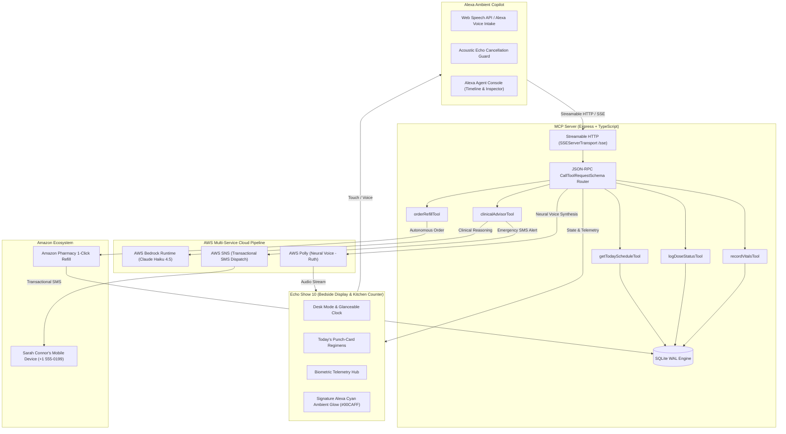

# CareBridge Ambient OS

<div align="center">

**Ambient Medication Adherence & Clinical Copilot for Amazon Echo Show 10**  
*Built for the Amazon Developer Hackathon 2026: Build, Ship, Shape.*

[-FF9900?style=for-the-badge&logo=amazonechoshow&logoColor=white)](https://devpost.com)
[](https://aws.amazon.com)
[](./LICENSE)
[](./FRICTION_LOG.md)
[](#-tech-stack)

[📺 Watch Live Demo (YouTube)](https://youtu.be/placeholder) • [💻 Public GitHub Repository](https://github.com/PHONGUIT22/CareBridge-Ambient) • [📑 Friction Log & DX Feedback](./FRICTION_LOG.md) • [📜 MIT License](./LICENSE) • [📐 Product Spec](./PRODUCT.md) • [🎨 Design System](./DESIGN.md)

</div>

---

## 🌟 Executive Summary

**CareBridge Ambient OS** transforms smart displays (specifically the **Amazon Echo Show 10**) into a 24/7 proactive, glanceable healthcare station for seniors living independently and remote family caregivers.

Millions of older adults forget daily medications or misjudge acute symptoms (such as orthostatic hypotension or coronary distress). Traditional mobile apps fail because seniors suffer from tremors, low vision, and app-navigation fatigue. CareBridge solves this with:
1. **Glanceable Bedside UX (6-Foot Rule):** High-contrast numerals, soothing dark surfaces, and oversized (56px+) tremor-tolerant touch targets (`"I TOOK MY PILL"`).
2. **Signature Alexa Cyan Ambient Glow (`#00CAFF`):** Physical hardware light bar emulating the iconic Echo Show emittance along the screen bezel during speech intake, Bedrock reasoning, and Polly synthesis.
3. **Autonomous Amazon Pharmacy Refills:** Automatically detects low stock ($\le 5$ tablets remaining) after dose confirmation, offering 1-click voice replenishment via Amazon Pharmacy (`orderRefillTool`).
4. **Triple-Service AWS Cloud Pipeline:** Chaining **Amazon Bedrock (Claude Haiku 4.5)** for clinical reasoning $\rightarrow$ **AWS Polly (Ruth Neural)** for voice synthesis $\rightarrow$ **AWS SNS (Transactional SMS)** for emergency family alerts.
5. **Zero-Latency Local Persistence:** Embedded SQLite engine operating in **Write-Ahead Logging (WAL)** mode for persistent, offline-resilient compliance auditing.

---

## 🎯 Hackathon Track Alignment & Submission Proof

| Devpost Submission Field | CareBridge Implementation | Runtime Verification & Evidence |
| :--- | :--- | :--- |
| **Primary Track: Alexa+** | Self-hosted Model Context Protocol (MCP) server complying with spec (2025-11-25+). Implements **Streamable HTTP Server-Sent Events (SSE)** transport (`/sse`, `/message`) and dual-view Echo Show 10 copilot simulator. | [`backend-mcp/src/server.ts`](./backend-mcp/src/server.ts)<br>Exposes 5 MCP tools via `SSEServerTransport` and JSON-RPC. |
| **Mini-Challenge: AWS Builder** | **End-to-End 3-Service AWS Pipeline:**<br>1. **Amazon Bedrock Runtime:** Claude Haiku 4.5 (`au.anthropic.claude-haiku-4-5-20251001-v1:0` in `ap-southeast-2`) for clinical reasoning.<br>2. **AWS Polly:** Neural TTS (`Ruth`) for empathic voice synthesis.<br>3. **AWS SNS:** High-priority `Transactional` SMS emergency dispatch to caregiver Sarah Connor (`+1 555-0199`). | [`backend-mcp/src/aws/bedrockClient.ts`](./backend-mcp/src/aws/bedrockClient.ts)<br>[`backend-mcp/src/aws/pollyClient.ts`](./backend-mcp/src/aws/pollyClient.ts)<br>[`backend-mcp/src/aws/snsClient.ts`](./backend-mcp/src/aws/snsClient.ts) |
| **Mini-Challenge: Open Source** | 100% open-source software under the permissive **MIT License**. Standard root license file and metadata visible directly in GitHub repository about section. | [`LICENSE`](./LICENSE)<br>Verified open-source repository. |
| **Judging Bonus (+10% Friction Log)** | Comprehensive Developer Experience (DX) report detailing **9 distinct integration hurdles** across Bedrock regional profiles, SSE persistence, audio feedback loops, and SNS sandbox constraints. | [`FRICTION_LOG.md`](./FRICTION_LOG.md)<br>9 deep-dive friction entries with actionable suggestions for AWS/Amazon teams. |

---

## 💡 Amazon Rule 6: Creative vs. Obvious Architecture

Amazon Hackathon Official Rule 6 penalizes simple wrappers or single-turn question-answering bots. Below is our direct architectural contrast:

| Criterion | ❌ Obvious Approach (Deductions) | 🏆 CareBridge Ambient OS (Creative High-Score) |
| :--- | :--- | :--- |
| **Purchasing & Commerce** | Static links or redirecting users to external checkout webpages. | **Autonomous Amazon Pharmacy 1-Click Refill:** Dose confirmation triggers stock threshold check ($\le 5$ pills). Agent proactively queries: *"You only have 3 pills left. Would you like me to order a 30-day refill via Amazon Pharmacy for $12.50?"*. Confirmation generates official Amazon Order ID (`114-XXXXXXX-XXXXXXX`), displays 2-Day Prime tracking, and auto-increments SQLite inventory (+30 tablets). |
| **State Persistence** | In-memory ephemeral variables lost on page refresh or power outage. | **ACID Multi-Turn Persistence:** Backed by SQLite in **WAL Mode** (`better-sqlite3`, `PRAGMA synchronous = NORMAL`). Manages multi-day dose logs, medication inventories, and biometric vitals across sessions. |
| **AWS Integration** | Single Bedrock API call generating plain text answers. | **Chained 3-Service Multi-Modal Pipeline:** Bedrock evaluates symptoms $\rightarrow$ AWS Polly streams neural voice audio $\rightarrow$ AWS SNS sends transactional SMS alert to daughter Sarah Connor $\rightarrow$ Echo Show UI updates live telemetry banner. |
| **Hardware Form Factor** | Generic mobile responsive layout with purple AI gradients. | **Hardware-Grade Echo Show 10 Experience:** Signature **Alexa Cyan Ambient Glow** (`#00CAFF` $\rightarrow$ `#0070F3`), glanceable 6-foot bedside clock, and oversized 56px+ tremor-friendly hitboxes designed specifically for geriatric ergonomics. |

---

## 🔍 Stage 1 Pass/Fail: Runtime Implementation Proof

To satisfy technical validation, below is the proof matrix showing direct runtime imports and execution locations within this repository:

### Core Frameworks & AWS SDKs

| Technology Required | Source File | Exact Runtime Import / Declaration | System Role |
| :--- | :--- | :--- | :--- |
| **MCP Server Engine** | [`backend-mcp/src/server.ts`](./backend-mcp/src/server.ts#L8) | `import { Server } from '@modelcontextprotocol/sdk/server/index.js';` | Protocol server initialization & JSON-RPC routing |
| **Streamable HTTP SSE** | [`backend-mcp/src/server.ts`](./backend-mcp/src/server.ts#L9) | `import { SSEServerTransport } from '@modelcontextprotocol/sdk/server/sse.js';` | Server-Sent Events `/sse` & `/message` endpoints for Alexa+ |
| **AWS Bedrock Runtime** | [`backend-mcp/src/aws/bedrockClient.ts`](./backend-mcp/src/aws/bedrockClient.ts#L1) | `import { BedrockRuntimeClient, InvokeModelCommand } from '@aws-sdk/client-bedrock-runtime';` | Claude Haiku 4.5 inference in Sydney (`ap-southeast-2`) |
| **AWS Polly Neural TTS** | [`backend-mcp/src/aws/pollyClient.ts`](./backend-mcp/src/aws/pollyClient.ts#L1) | `import { PollyClient, SynthesizeSpeechCommand } from '@aws-sdk/client-polly';` | Synthesizes generative voice response (`Ruth` voice) |
| **AWS SNS Transactional SMS** | [`backend-mcp/src/aws/snsClient.ts`](./backend-mcp/src/aws/snsClient.ts#L1) | `import { SNSClient, PublishCommand } from '@aws-sdk/client-sns';` | Transactional emergency dispatch to family caregiver |
| **SQLite WAL Engine** | [`backend-mcp/src/database/db.ts`](./backend-mcp/src/database/db.ts#L1) | `import Database from 'better-sqlite3'; db.pragma('journal_mode = WAL');` | Embedded ACID storage for dose logs and vitals |
| **Echo Show Hardware Light Bar** | [`frontend/src/components/AlexaAmbientGlow.tsx`](./frontend/src/components/AlexaAmbientGlow.tsx) | `export function AlexaAmbientGlow({ isListening, isThinking, isSpeaking }: AlexaAmbientGlowProps)` | Alexa Cyan (`#00CAFF`) bottom bezel light wave simulation |

### The 5 Registered MCP Tools

| MCP Tool Name | Implementation File | Handler Logic | Output Payload |
| :--- | :--- | :--- | :--- |
| `getTodaySchedule` | [`backend-mcp/src/tools/getTodaySchedule.ts`](./backend-mcp/src/tools/getTodaySchedule.ts) | Queries today's scheduled regimens, doses taken, and adherence rate. | JSON list of regimen items with dosage, timing, and status. |
| `logDoseStatus` | [`backend-mcp/src/tools/logDoseStatus.ts`](./backend-mcp/src/tools/logDoseStatus.ts) | Marks dose as `taken` or `skipped`, decrements stock, checks low stock threshold ($\le 5$). | Adherence delta + `lowStockAlert` triggering Amazon Pharmacy refill. |
| `recordVitals` | [`backend-mcp/src/tools/recordVitals.ts`](./backend-mcp/src/tools/recordVitals.ts) | Stores blood pressure, blood glucose, and heart rate telemetry. | Updated biometric record timestamped in SQLite WAL. |
| `clinicalAdvisor` | [`backend-mcp/src/tools/clinicalAdvisor.ts`](./backend-mcp/src/tools/clinicalAdvisor.ts) | Sends symptoms to Bedrock Claude Haiku 4.5. On `HIGH`/`EMERGENCY`, triggers AWS SNS. | Triage level (`LOW`, `MEDIUM`, `HIGH`, `EMERGENCY`), action advice, and `smsDispatch`. |
| `orderRefill` | [`backend-mcp/src/tools/orderRefill.ts`](./backend-mcp/src/tools/orderRefill.ts) | Simulates Amazon Pharmacy 1-click refill order, replenishes stock (+30 pills). | Amazon Order ID (`114-XXXXXXX-XXXXXXX`), Prime 2-day delivery date, and total price. |

---

## 🏗️ System Architecture



---

## ⚡ 1-Click Evaluator Sandbox Pass (Judge Testing Guide)

We have built an **Evaluator Sandbox Gate** into the application so judges can test every feature without manual database setup, credit card entry, or complex CLI operations:

### Step 1: Open the Application
Launch the frontend at `http://localhost:3000`. You will be greeted by the **CareBridge Authentication Gate**.

### Step 2: Click the 1-Click Evaluator Pass
Click the prominent button:  
👉 **"Sign in with demo (1-click evaluator pass)"**

*What happens automatically under the hood:*
- Calls the `/api/seed` endpoint on the MCP server.
- Injects **30 days of clinically realistic adherence records**, biometric vital trends, and medication stocks into SQLite WAL.
- Unlocks **CareBridge Pro tier** across all screens.

---

### Step 3: Run the 4 One-Tap Hackathon Test Scenarios

Use the convenient quick-test prompt chips on the **Alexa Agent Console** (right panel in Dual Mode):

```
┌────────────────────────────────────────────────────────────────────────┐
│  [💬 What's my schedule?]   [💊 Took Atorvastatin (Low Stock)]         │
│  [📦 Yes, Order Refill]     [🚨 Severe Chest Pain (Emergency SNS)]     │
└────────────────────────────────────────────────────────────────────────┘
```

#### 1. Daily Schedule & Voice Retrieval
- **Voice/Click:** `"Alexa, what's my medicine schedule today?"`
- **MCP Tool:** `getTodaySchedule`
- **Result:** Alexa reads upcoming doses. Punch-card visual updates on screen.

#### 2. Amazon Pharmacy 1-Click Refill (Autonomous Commerce)
- **Voice/Click:** `"Alexa, I just took my Atorvastatin pill"`
- **MCP Tool:** `logDoseStatus`
- **Agent Prompt:** Alexa detects Atorvastatin stock has dropped to 3 tablets ($\le 5$ warning):  
  *"Logged as taken. Heads up: you only have 3 pills left. Would you like me to order a 30-day refill via Amazon Pharmacy for $12.50?"*
- **Follow-up Voice/Click:** `"Yes, order it"` (or click `[📦 Yes, Order Refill]`)
- **MCP Tool:** `orderRefill`
- **Result:** Renders the high-contrast `AmazonOrderCard` with Amazon Order ID `#114-7291048-8192031`, Prime 2-Day free delivery estimate, and auto-replenishes SQLite stock (+30 pills).

#### 3. Bedrock Clinical Triage & Emergency SMS Dispatch via AWS SNS
- **Voice/Click:** `"Alexa, I have severe crushing chest pain and shortness of breath"`
- **MCP Tool:** `clinicalAdvisor`
- **AWS Pipeline:**
  1. **Bedrock Claude Haiku 4.5** assesses symptoms, tags risk level as `EMERGENCY`.
  2. **AWS Polly (Ruth)** speaks calming instructions: *"I've flagged this as an emergency. Sit down immediately. I have just dispatched an urgent SMS alert with your location and current vitals to your daughter Sarah."*
  3. **AWS SNS** dispatches a `Transactional` SMS with vitals to Sarah Connor (`+1 555-0199`).
- **Result:** Renders the `ClinicalAdviceCard` with an active emergency banner showing the AWS SNS Message ID, carrier timestamp, and delivery telemetry.

#### 4. Export Physician Compliance PDF
- Navigate to the **History** tab on the Echo Show display.
- Click **"Export Doctor PDF"**.
- Generates a clinical-grade A4 consultation report (`jsPDF`) containing 30-day compliance percentages, missed-dose chronologies, and blood pressure telemetry.

---

## 🛠️ Tech Stack & Workspace Structure

```
carebridge-ambient/
├── backend-mcp/                     # Model Context Protocol Server (Port 3001)
│   ├── src/
│   │   ├── aws/
│   │   │   ├── bedrockClient.ts     # AWS Bedrock Claude Haiku 4.5 Integration
│   │   │   ├── pollyClient.ts       # AWS Polly Neural TTS Engine (Ruth)
│   │   │   └── snsClient.ts         # AWS SNS Transactional SMS Dispatcher
│   │   ├── database/
│   │   │   ├── db.ts                # SQLite WAL Mode Persistence Engine
│   │   │   ├── medicineRepo.ts      # Medication Catalog & Stock Levels
│   │   │   ├── logRepo.ts           # Adherence Punch-Card History
│   │   │   ├── vitalsRepo.ts        # Blood Pressure & Heart Rate Records
│   │   │   └── seedDemoData.ts      # 30-Day Clinical Data Seeder
│   │   ├── tools/
│   │   │   ├── getTodaySchedule.ts  # MCP: getTodaySchedule
│   │   │   ├── logDoseStatus.ts     # MCP: logDoseStatus (Low-Stock Trigger)
│   │   │   ├── recordVitals.ts      # MCP: recordVitals
│   │   │   ├── clinicalAdvisor.ts   # MCP: clinicalAdvisor (Bedrock + SNS)
│   │   │   └── orderRefill.ts       # MCP: orderRefill (Amazon Pharmacy)
│   │   └── server.ts                # Streamable HTTP (SSE) & Express Router
│   ├── tsconfig.json                # NodeNext ESM Configuration
│   └── package.json                 # Workspaces & MCP Dependencies
├── frontend/                        # Echo Show 10 Ambient Display (Port 3000)
│   ├── src/
│   │   ├── app/
│   │   │   ├── globals.css          # Alexa Cyan Light Bar Keyframes & Utilities
│   │   │   └── page.tsx             # Smart Display Shell & Dual Frame View
│   │   ├── components/
│   │   │   ├── AlexaAmbientGlow.tsx # Signature Echo Show Cyan Hardware Light Bar
│   │   │   ├── AlexaAgentConsole.tsx# Developer Timeline & Raw JSON Inspector
│   │   │   ├── AuthGate.tsx         # Evaluator 1-Click Sandbox Login
│   │   │   └── RichCards/           # ClinicalAdvice, AmazonOrder, PillVisual Cards
│   │   ├── hooks/
│   │   │   └── useAlexaAgent.ts     # Unified Multi-Turn Voice Orchestrator
│   │   └── services/
│   │       ├── mcpClient.ts         # Streamable HTTP / SSE Client
│   │       └── speechService.ts     # Two-Tier Speech (Polly -> Web Speech)
│   └── package.json                 # Next.js 15, React 19, Tailwind CSS
├── FRICTION_LOG.md                  # Developer Friction Log (9 In-Depth Entries)
├── PRODUCT.md                       # Comprehensive Product Specification & Personas
├── DESIGN.md                        # Industrial Design Tokens & Ergonomics Guidelines
├── LICENSE                          # MIT Open Source License
└── package.json                     # Monorepo Root Workspaces Configuration
```

---

## 🚀 Quick Start & Installation

### 1. Prerequisites
- **Node.js:** v18.0.0+ (Node v20 LTS recommended)
- **npm:** v9.0.0+
- **AWS Account:** (Optional for live keys — system includes resilient offline simulation mode) with access to Bedrock (`ap-southeast-2`), Polly, and SNS.

### 2. Clone & Install Monorepo
```bash
git clone https://github.com/PHONGUIT22/CareBridge-Ambient.git
cd CareBridge-Ambient
npm install
```

### 3. Environment Configuration
Copy `.env.example` to `.env` at the root and in `backend-mcp/`:
```bash
cp .env.example .env
```

Your `.env` file structure:
```env
# AWS Cloud Configuration (Mini-challenge: AWS Builder)
AWS_REGION=ap-southeast-2
AWS_ACCESS_KEY_ID=your_access_key_here
AWS_SECRET_ACCESS_KEY=your_secret_key_here
BEDROCK_MODEL_ID=au.anthropic.claude-haiku-4-5-20251001-v1:0

# AWS SNS Emergency SMS Dispatch
CAREGIVER_PHONE=+15550199

# AWS Polly Neural Voice Synthesis
POLLY_VOICE_ID=Ruth

# Server Ports
MCP_PORT=3001
NEXT_PUBLIC_MCP_URL=http://localhost:3001
```

> **Note on Sandbox Resiliency:** If AWS credentials are not configured, CareBridge automatically activates its built-in **Clinical Fallback Engine**, allowing judges to test the complete voice loop, triage cards, and simulated SNS delivery without AWS access errors.

### 4. Run Development Servers
Open two terminal windows:

**Terminal 1 (Backend MCP Server):**
```bash
npm run dev --workspace=backend-mcp
```
*Server starts on `http://localhost:3001` with SSE stream at `/sse`.*

**Terminal 2 (Frontend Echo Show 10 UI):**
```bash
npm run dev --workspace=frontend
```
*Application opens at `http://localhost:3000`.*

### 5. Production Build Verification
To verify code compilation with zero errors or warnings:
```bash
npm run build --workspace=backend-mcp
npm run build --workspace=frontend
```

---

## 📑 Hackathon Documentation Directory

- **[FRICTION_LOG.md](./FRICTION_LOG.md):** 9 real integration friction reports covering Bedrock inference profiles, SSE transport persistence, Web Speech concurrency, acoustic echo cancellation, and SNS sandbox constraints.
- **[PRODUCT.md](./PRODUCT.md):** Detailed product vision, clinical problem statement, and user personas (Eleanor Vance, 78 & Sarah Connor, 48).
- **[DESIGN.md](./DESIGN.md):** Complete design system specification covering WCAG AAA contrast tokens, surface physics, and Echo Show 10 hardware simulation.
- **[LICENSE](./LICENSE):** Permissive MIT Open Source License.

---

## 📜 License

Distributed under the **MIT License**. See [`LICENSE`](./LICENSE) for more information.

Copyright (c) 2026 CareBridge Ambient Team. Built for the Amazon Developer Hackathon 2026.
